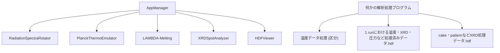

# アプリ起動/解析プログラムのフロー

```mermaid
flowchart TB
  app_manager["AppManager"] --> app_rotator["RadiationSpectraRotator"]
  app_manager --> app_planck["PlanckThermoEmulator"]
  app_manager --> app_melting["LAMBDA-Melting"]
  app_manager --> app_xrd["XRDSpotAnalyzer"]
  app_manager --> app_hdf["HDFViewer"]

  analysis_program["何かの解析処理プログラム"] --> temp_lane["温度データ処理 (区分)"]
  analysis_program --> out_run["1 runにおける温度・XRD・圧力など処理済みデータ.hdf"]
  analysis_program --> out_xrd["cake・patternなどXRD処理データ.hdf"]
```

## 注記（source/target が未設定の矢印）

- 「解析する人」→「何かの解析処理プログラム」は、矢印の `source` が未設定のため図に含めていません。
