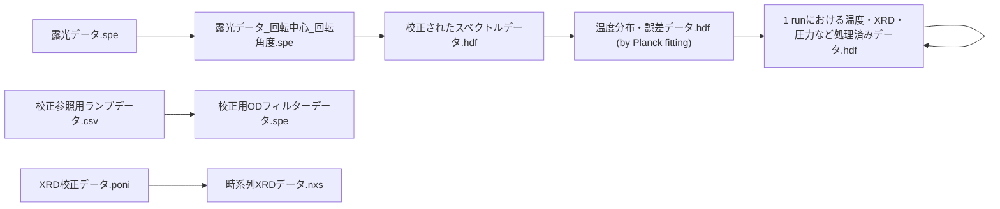

# データフロー（入出力の流れ）

## 注記（source/target が未設定の矢印）

`process_flow.drawio` 内にあるものの、矢印の `source` が未設定で判別できない接続は以下です。

- 不明な接続 → 温度、誤差データ（by 二色法）
- 不明な接続 → 1 runにおける温度・XRD・圧力など処理済みデータ.hdf
- 不明な接続 → cake・patternなどXRD処理データ.hdf

必要に応じてSVGの視認で補完してください。
