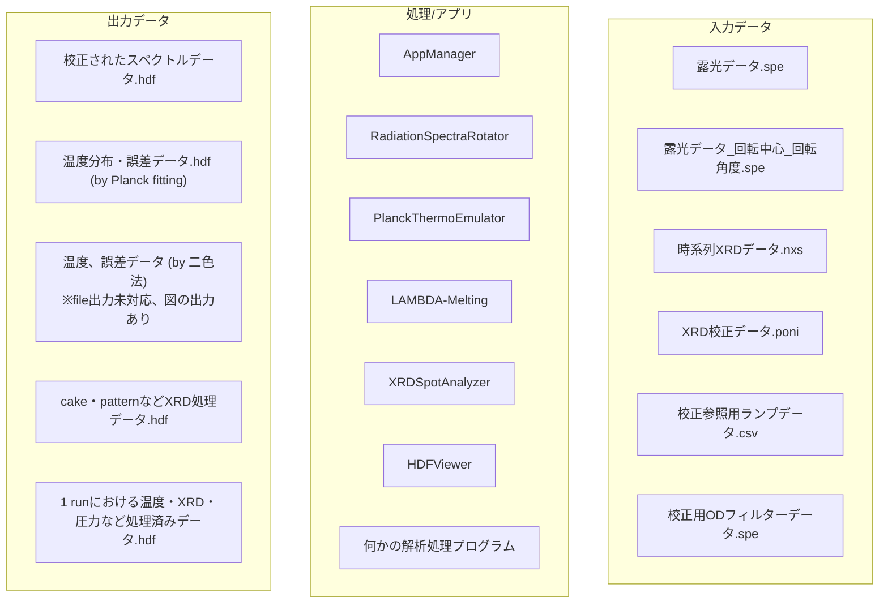

# ノード一覧（入力/処理/出力）

```mermaid
flowchart TB
  subgraph Inputs[入力データ]
    in_exposure["露光データ.spe"]
    in_exposure_rot["露光データ_回転中心_回転角度.spe"]
    in_xrd_time["時系列XRDデータ.nxs"]
    in_xrd_calib["XRD校正データ.poni"]
    in_lamp["校正参照用ランプデータ.csv"]
    in_od_filter["校正用ODフィルターデータ.spe"]
  end

  subgraph Processes[処理/アプリ]
    app_manager["AppManager"]
    app_rotator["RadiationSpectraRotator"]
    app_planck["PlanckThermoEmulator"]
    app_melting["LAMBDA-Melting"]
    app_xrd["XRDSpotAnalyzer"]
    app_hdf["HDFViewer"]
    analysis_program["何かの解析処理プログラム"]
  end

  subgraph Outputs[出力データ]
    out_spectrum["校正されたスペクトルデータ.hdf"]
    out_planck["温度分布・誤差データ.hdf (by Planck fitting)"]
    out_twocolor["温度、誤差データ (by 二色法)\n※file出力未対応、図の出力あり"]
    out_xrd["cake・patternなどXRD処理データ.hdf"]
    out_run["1 runにおける温度・XRD・圧力など処理済みデータ.hdf"]
  end
```

## 補足

- 上記は `images/process_flow.drawio` 内のラベルを整理した一覧です。
- 「温度データ処理」「XRDデータ処理」などのスイムレーンはフロー区分のため、ここではノードとしては扱っていません。
